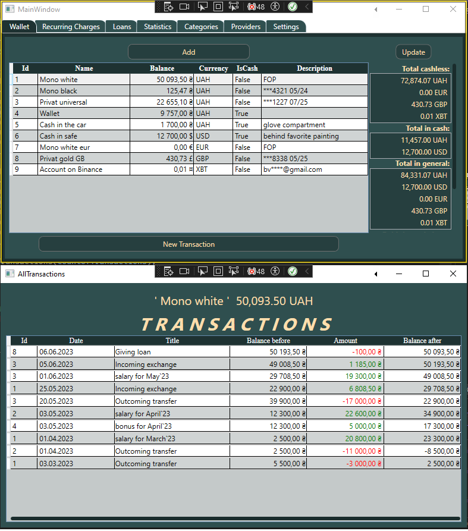

# Financial Manager

This app helps you record your financial transactions, generate reports (spending and income), and review your financial transactions in a selected date range.
You can also create recurring charges with specified periodicity.
It has very detailed statistics with filters in the form of reports (linear and column graphs).  

Some screens:

